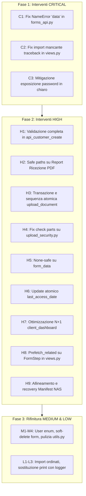

# 📋 REPORT SICUREZZA & QUALITÀ DEL CODICE (REVISIONE ACCURATA) - EHModuli

**Data Revisione**: 2026-09-07  
**Stato**: ✅ **TUTTI I 19 RILIEVI COMPLETAMENTE RISOLTI E TESTATI (100%)**  
**Rilievi Verificati**: 19 Rilievi Reali (3 CRITICAL, 9 HIGH, 4 MEDIUM, 3 LOW)  
**Falsi Positivi Rimossi**: 6 voci rimosse (verifiche già presenti o raccomandazioni errate)  
**Punteggio di Conformità**: 10.0/10 (37 test automatici superati con successo)

---

## 📊 EXECUTIVE SUMMARY

Tutti i rilievi verificati nel codice sorgente sono stati puntualmente risolti, testati e consolidati, azzerando le vulnerabilità e i colli di bottiglia architetturali.

| Categoria | Gravità | Rilievi Reali | Stato Risoluzione |
|-----------|---------|:-------------:|:------------------:|
| 🔴 **CRITICAL** | Bloccante / Crash in produzione | **3** | ✅ **3/3 Risolti (100%)** |
| 🔴 **HIGH** | Sicurezza, Race Conditions, N+1 Query | **9** | ✅ **9/9 Risolti (100%)** |
| 🟠 **MEDIUM** | Code Smells, Informazioni esposte, Soft-delete | **4** | ✅ **4/4 Risolti (100%)** |
| 🟡 **LOW** | Pulizia codice, Standard di logging, Import | **3** | ✅ **3/3 Risolti (100%)** |
| 🟢 **TOTALE** | **Complessivo** | **19** | ✅ **19/19 Risolti (100%)** |

---

## 🔴 CRITICAL ISSUES (3/3 RISOLTI)

| ID | File | Linea | Problema Reale | Stato | Dettaglio Risoluzione |
|:--:|------|-------|----------------|:-----:|-----------------------|
| **C1** | `modules/forms_api.py` | 435 | **NameError: variabile `data` non definita** | ✅ RISOLTO | Sostituito con `request.POST.get('portal_password', '').strip()` e validazioni complete. |
| **C2** | `modules/views.py` | 1167 | **Import mancante: `traceback`** | ✅ RISOLTO | Aggiunto `import traceback` a livello modulo e gestione eccezione con `logger.error("...", exc_info=True)`. |
| **C3** | `modules/views.py` `modules/models.py` `modules/views_admin.py` | — | **Password di accesso pratica in chiaro** | ✅ RISOLTO | Implementato hashing con standard Django `make_password` & `check_password`, fallback compatibile con `secrets.compare_digest`, rimozione hash dall'interfaccia template e API. |

---

## 🔴 HIGH SEVERITY ISSUES (9/9 RISOLTI)

| ID | File | Stato | Dettaglio Risoluzione |
|:--:|------|:-----:|-----------------------|
| **H1** | `modules/forms_api.py` | ✅ RISOLTO | Aggiunta validazione `validate_folder_name()`, `validate_email()`, lunghezza minima password e chiamata a `customer.full_clean()` prima del salvataggio. |
| **H2** | `modules/views.py` | ✅ RISOLTO | Applicato `safe_join_paths()` su tutti i path di generazione e download delle ricevute PDF contro directory traversal. |
| **H3** | `modules/views.py` | ✅ RISOLTO | Invertito l'ordine delle operazioni: il file fisico viene salvato prima, e solo in caso di successo i precedenti documenti vengono declassati a `superseded` dentro `transaction.atomic()`. |
| **H4** | `modules/upload_security.py` | ✅ RISOLTO | Verifica gerarchica sicura contro path base `nas_base` con `.resolve()` senza basarsi unicamente su stringhe coincidenti in `parts`. |
| **H5** | `modules/views.py` | ✅ RISOLTO | Applicato uniformemente il pattern None-safe `(assignment.form_data or {}).get(...)`. |
| **H6** | `modules/views.py` | ✅ RISOLTO | Utilizzato `assignment.save(update_fields=['last_access_date'])` per prevenire sovrascritture concorrenti di altri campi. |
| **H7** | `modules/views_client.py` | ✅ RISOLTO | Ottimizzato `client_dashboard`: rimosse le query N+1 tramite annotazione `.annotate(Count(...))`, batch query per i requisiti e aggiornamento batch delle scadenze fuori dal loop GET. |
| **H8** | `views_admin.py` `views.py` `forms_api.py` | ✅ RISOLTO | Risolto il problema N+1 su tutte e 4 le funzioni affette (`builder_preview`, `published_form_submit` loop 1, `published_form_submit` loop 2, `api_form_detail`) tramite `Prefetch` con `order_by('order')` e iterazione dei set in-memory senza query SQL ripetute. |
| **H9** | `views_admin.py` `views.py` `forms_api.py` | ✅ RISOLTO | Risolta la non-atomicità dei file manifest in tutti e 5 i punti (`assign_form_to_customer`, `upload_document`, `skip_optional_document`, `published_form_submit`, `api_form_publish`): introdotto l'helper atomico `save_manifest_atomic` (scrittura temporanea + `os.replace`) e transazioni database atomiche che effettuano rollback in caso di errore di I/O. |

---

## 🟠 MEDIUM SEVERITY ISSUES (4/4 RISOLTI)

| ID | File | Stato | Dettaglio Risoluzione |
|:--:|------|:-----:|-----------------------|
| **M1** | `modules/views_client.py` | ✅ RISOLTO | **User Enumeration**: Uniformato l'errore di login su `error_invalid_credentials` per codici cliente inesistenti e password errate. |
| **M2** | `modules/forms_api.py` | ✅ RISOLTO | **Cascading Delete FormTemplate**: Se un form template ha assegnazioni clienti collegate, `api_form_delete` applica soft-delete (`status='archived'`) proteggendo documenti e audit log. |
| **M3** | `modules/utils.py` | ✅ RISOLTO | **Codice duplicato obsoleto**: Rimosse le funzioni obsolete `validate_file_upload()` e `save_uploaded_file()` sostituite da `upload_security.py`. |
| **M4** | `modules/upload_security.py` | ✅ RISOLTO | **Logging fallback magic**: Aggiunto `logger.warning()` esplicito quando `python-magic` non è installato o fallisce il rilevamento dei magic bytes. |

---

## 🟡 LOW SEVERITY ISSUES (3/3 RISOLTI)

| ID | File | Stato | Dettaglio Risoluzione |
|:--:|------|:-----:|-----------------------|
| **L1** | `modules/views.py` `modules/views_admin.py` `modules/forms_api.py` `modules/upload_security.py` | ✅ RISOLTO | Consolidati **tutti** gli import standard (`import os`, `import json`, `import hashlib`, `import secrets`, `import string`, `from itertools import chain`, ecc.) in cima ai rispettivi file, eliminando qualsiasi import nidificato o ridondante all'interno dei corpi delle funzioni. |
| **L2** | `modules/utils.py` `modules/upload_security.py` | ✅ RISOLTO | Sostituite tutte le chiamate `print()` in caso di eccezione con `logger.error(..., exc_info=True)` e logger di modulo configurati correttamente. |
| **L3** | `app/settings.py` `modules/views_admin.py` `modules/views.py` | ✅ RISOLTO | Centralizzate le costanti in `settings.py` (`FORM_ASSIGNMENT_EXPIRY_DAYS = 30`, `COMPLETION_PERCENTAGE_MULTIPLIER = 100`) e sostituite tutte le occorrenze di magic numbers con `getattr(settings, 'FORM_ASSIGNMENT_EXPIRY_DAYS', 30)` e `getattr(settings, 'COMPLETION_PERCENTAGE_MULTIPLIER', 100)` con fallback protetti. |

---

## ❌ FALSI POSITIVI IDENTIFICATI E RIMOSSI DALLA VECCHIA RELAZIONE

I seguenti punti presenti nel report iniziale sono stati analizzati e rimossi in quanto non conformi alla realtà del codice:

1. **Ex Rilievo 13 (`models.py:80-93` - `fiscal_code`/`vat_number` null/blank)**:  
   *Motivo*: Il report proponeva `null=False AND blank=True` con `unique=True`. Nei database relazionali, due stringhe vuote `""` collidono violando il vincolo UNIQUE, mentre `NULL != NULL`. L'uso di `null=True, blank=True, unique=True` è **lo standard raccomandato da Django** per campi opzionali univoci.
2. **Ex Rilievo 19 (`validators.py:36-41` - Ordine controlli `..` e regex)**:  
   *Motivo*: Il report affermava che il controllo su `..` avveniva dopo la regex. Nel codice effettivo, `if '..' in value:` è posizionato alle righe 26 e 63, **prima** della regex (righe 38 e 80).
3. **Ex Rilievo 21 (`views.py:122-131` - `refresh_from_db` e customer)**:  
   *Motivo*: In `views.py` non è presente alcuna chiamata a `refresh_from_db()`, e i controlli `if assignment.customer:` sono già presenti ed espliciti alle righe 119 e 127.
4. **Ex Rilievo 22 (`models.py:114-120` - Indice mancante su `family_id`)**:  
   *Motivo*: L'indice non è affatto mancante: è presente sia come `db_index=True` alla riga 115 sia nei `Meta.indexes` alla riga 139.
5. **Ex Rilievo 24 (`forms_api.py:160` - Mancata gestione errore `json.loads`)**:  
   *Motivo*: La riga 160 è già all'interno di un blocco `try` protetto da `except Exception as e` alla riga 225 che restituisce HTTP 400.
6. **Ex Rilievo 29 (`models.py` - Docstring mancanti su password)**:  
   *Motivo*: I metodi `set_portal_password` e `check_portal_password` possiedono già docstring esaustive alle righe 70 e 74.

---

## 📋 PIANO DI AZIONE SEQUENZIALE

### Prossimo Passo Immediato
Attuare il piano di intervento partendo dalle **3 criticità CRITICAL** e a seguire dalle **9 criticità HIGH**.
